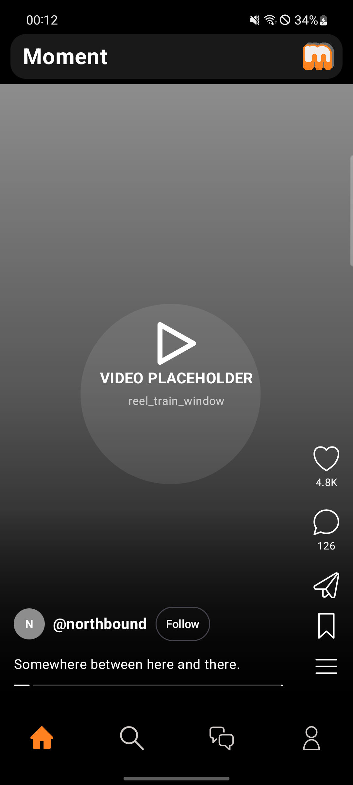
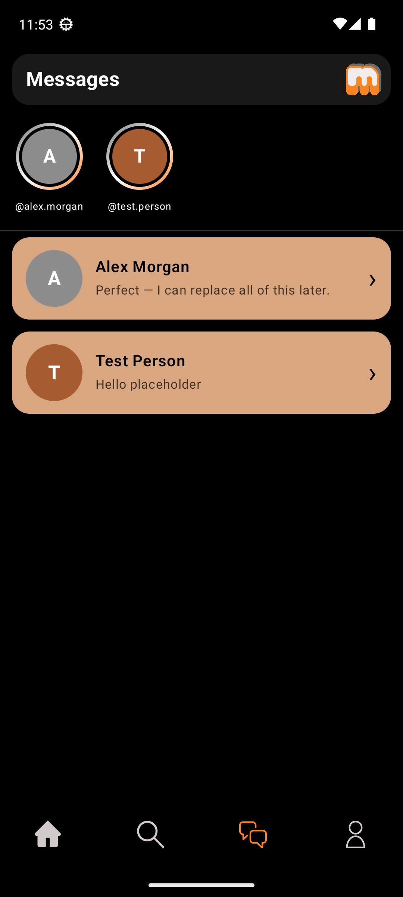
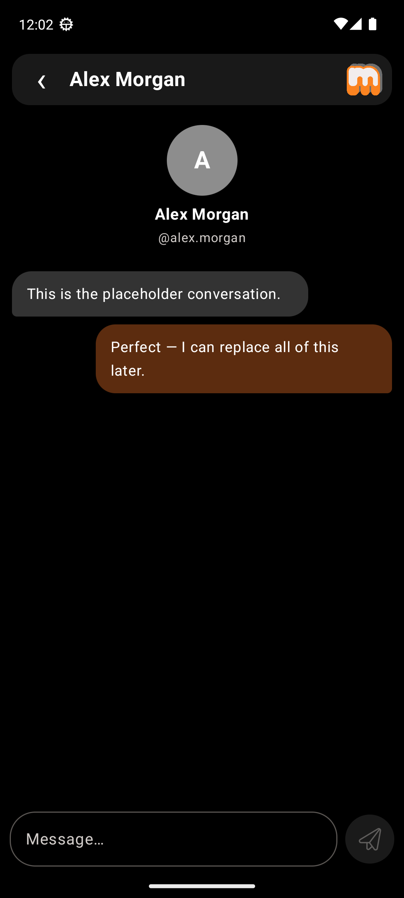
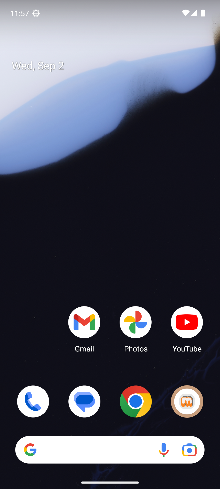
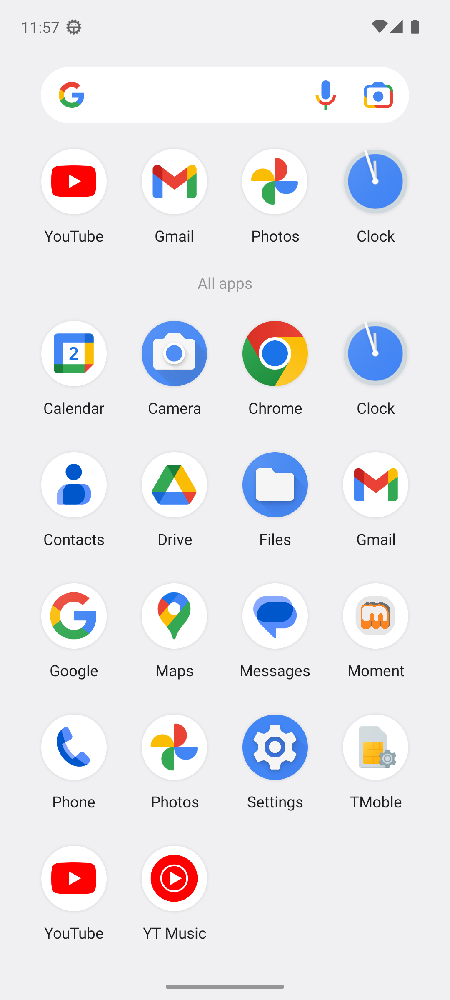

# Moment

Moment is a deterministic, offline Android film prop built for controlled on-camera playback. It recreates the small set of social-media-style flows needed by a production: vertical reels, image carousels, search collections, messages, staged notifications, and a scripted blackout screen.

It is deliberately not a social network or an Instagram client. There is no account system, backend, login, analytics, or network permission. Everything is local to the device and designed to be repeatable between takes.

<p align="center">
  
  
  
</p>

## What it does

- **Reels** — swipe through looping placeholder/imported videos and horizontally swipeable image carousels.
- **Search** — two deterministic collections: one for a blank query and one for any non-empty query. Opening a result keeps the search field visible.
- **Messages** — persistent fake conversations with profile metadata, initial history, text or voice replies, and local Android notifications.
- **Director controls** — a hidden on-device editor for posts, chats, and scripted scenes. Open it by tapping the Reels title five times quickly.
- **Staged uninstall** — a fake uninstall confirmation that transitions to a persistent, full-screen black frame with a lower-left recovery gesture.

## Screenshots

### In-app surfaces

<p align="center">
  
  
  
</p>

### Android launcher surfaces

The launcher icon and in-app identity use separate supplied PNG artwork: the homescreen variant is used by Android, while the normal variant is used inside Moment.

<p align="center">
  
  
</p>

## Quick start

### Requirements

- Windows, macOS, or Linux with Android Studio tooling
- JDK 17
- Android SDK with platform 37 and build tools installed
- A connected Android phone or an A51-shaped emulator

Build the debug APK and run the JVM tests:

```powershell
.\gradlew.bat :app:assembleDebug :app:testDebugUnitTest
```

Install and launch on one connected Android target:

```powershell
adb install -r app\build\outputs\apk\debug\app-debug.apk
adb shell am start -n com.tyler.scenegram/.MainActivity
```

The package remains `com.tyler.scenegram` so `adb install -r` preserves programmed Director content and copied media across debug updates.

## Programming a take

1. Open Reels and tap **Moment** five times quickly to reveal **Director controls**.
2. Under **Add a post**, choose Reels or one of the Search collections, then select pictures or a video. Moment copies selected media into app-private storage.
3. Add fake people and initial chat history under **Add a chat**.
4. Create a chat scene with optional delayed opening notifications and one reply step for each app-user send.
5. Press **Start** on a saved scene and film the ordinary chat screen. Script status, actor cues, scene names, and countdowns are intentionally hidden from the filmed UI.

For notifications, keep Moment foregrounded, grant Android notification permission, raise notification volume, and disable Do Not Disturb. Delayed cues require the app process to remain alive.

## Architecture

| Area | Implementation |
| --- | --- |
| UI | Kotlin, Jetpack Compose, Material 3 |
| Video | AndroidX Media3 ExoPlayer with adjacent reel preparation and texture surfaces |
| Images | Sampled bitmap decoding with EXIF orientation handling |
| State | `AppViewModel` with deterministic `AppUiState` transitions |
| Persistence | Versioned JSON in SharedPreferences plus app-private copied media |
| Notifications | Local Android notification channel with chat deep links |
| Voice | Android on-device `TextToSpeech` |
| Minimum Android | API 26 |

The main implementation files are:

- [`SceneGramApp.kt`](app/src/main/java/com/tyler/scenegram/ui/SceneGramApp.kt) — root theme, routing, header, navigation, chat, account, and blackout UI.
- [`MomentPosts.kt`](app/src/main/java/com/tyler/scenegram/ui/MomentPosts.kt) — Reels/Search presentation, carousels, imported media, and visual palette.
- [`DirectorScreen.kt`](app/src/main/java/com/tyler/scenegram/ui/DirectorScreen.kt) — on-device post, chat, and scene editor.
- [`AppViewModel.kt`](app/src/main/java/com/tyler/scenegram/director/AppViewModel.kt) — state, persistence coordination, scenes, notifications, and TTS.
- [`MomentContentStore.kt`](app/src/main/java/com/tyler/scenegram/director/MomentContentStore.kt) — JSON compatibility and private media management.

## Continuity and safety

Moment is designed for filming, not production data. Imported posts, chats, scenes, and copied media persist through normal restarts and `adb install -r` updates, but they live only on the selected device. Clearing app data or genuinely uninstalling the package removes that content.

Use only names, images, audio, and video that the production owns or is licensed to use. Moment does not connect to Instagram or any other third-party service.

## AI-assisted development disclaimer

Parts of this repository’s source code, documentation, UI copy, and visual implementation were generated or refined with AI assistance under human direction. AI output can contain mistakes, omissions, or unsuitable assumptions; the project owner is responsible for reviewing, testing, and approving the final result. AI assistance does not grant rights to any third-party brand, person, media asset, font, or source material. Verify all production assets and licenses independently before use.

## Project status

This is a purpose-built film prop and an actively edited production tool. The checked-in application ID, internal `SceneGram` names, and deterministic placeholder content are intentional compatibility details; cosmetic renaming should not change the package ID or break saved device content.
